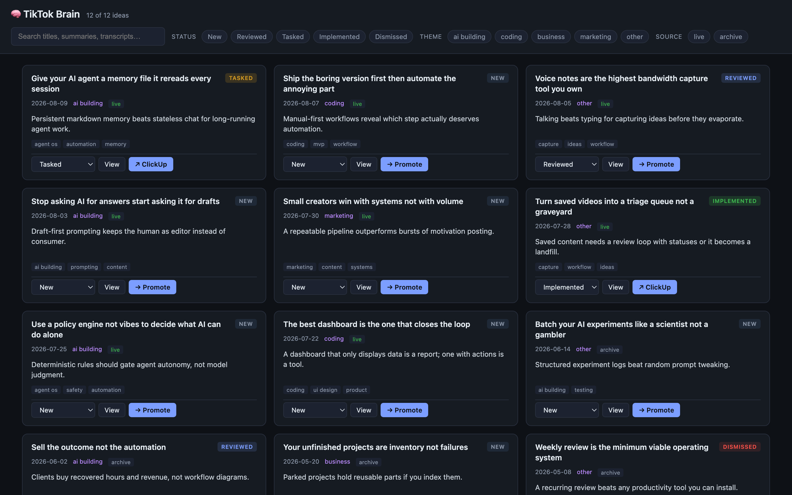
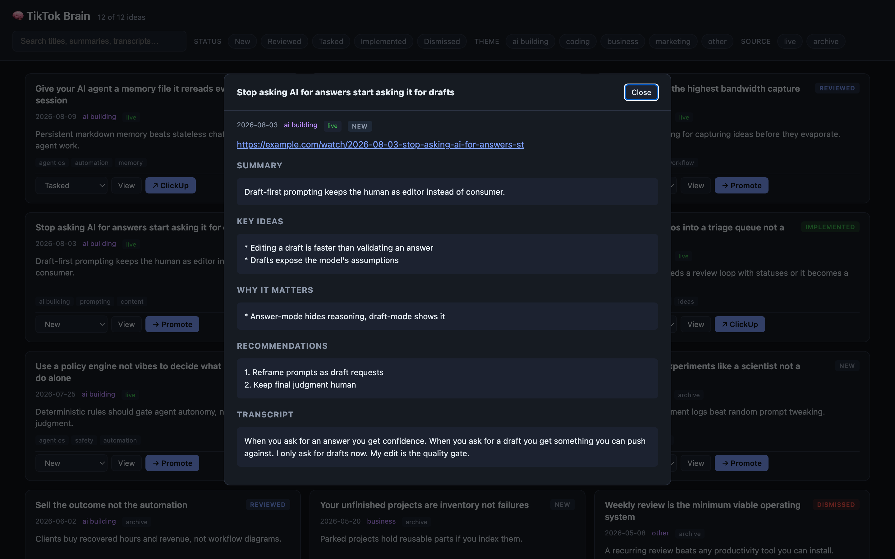

# TikTok Brain — Content Ops Dashboard

A visual triage layer for captured content ideas. Ideas arrive by voice note or
shared link, an AI agent transcribes and categorizes them into markdown, and
this dashboard turns the pile into a reviewable queue: filter, read the
transcript, set a status, or promote an idea into the task system with one
click.

> **About this repository.** This is the public showcase build of a private
> production tool. The 130+ real captured ideas were replaced with fictional
> demo data, and the serverless write functions, live domain, and account
> integrations were removed. The UI, the build pipeline, and the parsing code
> are the production versions.





## Why it exists

Saved folders are where ideas go to die. This closes the loop: every capture
gets a status (New, Reviewed, Tasked, Implemented, Dismissed), a weekly review
becomes a five-minute triage pass, and the good ideas leave the queue as real
tasks instead of bookmarks.

## How the production pipeline works

```
Telegram voice note / link → watcher daemon → AI transcription + categorization
                                                        ↓
                                    workspace markdown notes + INDEX.md
                                                        ↓
                              launchd fswatch daemon → scripts/build.py
                                                        ↓
                                  public/data.json + public/last_built.json
                                                        ↓
                                         git push → Netlify deploy
```

In production, status edits and task promotions go through Netlify Functions
that write a status overlay back to the repo via the GitHub Contents API and
create tasks in ClickUp. `build.py` merges the overlay on every rebuild, so
the markdown index stays the canonical ledger from the agent's perspective.
Those functions are removed from this showcase; the demo UI keeps changes in
browser memory instead.

## Run it locally

No dependencies beyond Python 3 and a browser:

```bash
python3 scripts/build.py          # parses demo-workspace/ into public/data.json
python3 -m http.server -d public 8000
open http://localhost:8000
```

Point `BRAIN_WORKSPACE` at any folder with `live/` and `archive/` note trees
to build from your own data.

## Files

| Path | Purpose |
|------|---------|
| `public/index.html` | Single-page UI, vanilla JS, no framework |
| `public/data.json` | Generated by build.py from the workspace notes |
| `public/status.json` | Triage status overlay per idea |
| `public/last_built.json` | Build timestamp, counts, parse warnings |
| `scripts/build.py` | Parses INDEX.md + note frontmatter/sections into data.json |
| `demo-workspace/` | Fictional demo notes in the production markdown format |

## Note format

Each idea is one markdown file with frontmatter (`date`, `tags`, `summary`,
`source`) and four sections: Key Ideas, Why It Matters, Recommendations,
Transcript. `INDEX.md` is a table the agent appends to at capture time, and
the builder treats it as the source of truth for what exists.
